# BiFriends BE — 데이터베이스 ERD

PostgreSQL(JPA) 테이블 관계·설명 문서입니다.  
**총 19 테이블** (엔티티 17 + ElementCollection 보조 테이블 2).  
마음챙김(`mindSessions`)은 **Firestore** 전용이라 이 ERD에 포함하지 않습니다.

---

## 문서 보는 방법

| 방법 | 배포 필요? | 설명 |
|------|------------|------|
| **[ERD.html](./ERD.html) 로컬 열기 (인터랙티브)** | ❌ | 상단 전체 관계도 + 하단 검색·테이블 카드 클릭 → 상세 스키마 (인터넷 필요) |
| **GitHub `ERD.md` 링크** | ❌ (push만) | GitHub가 Markdown을 **이미 HTML처럼** 렌더링 + Mermaid 지원 |
| **GitHub Pages** | ⚙️ 한 번 설정 | 팀 공유용 고정 URL (`…github.io/…/ERD.html`). Docker·자체 서버 불필요 |
| **Mermaid Live** | ❌ | 아래 다이어그램 코드를 [mermaid.live](https://mermaid.live)에 붙여넣기 |

### 공유용 링크 (push 후)

- Markdown: `https://github.com/quad-S-BIFriends/bifriends-be/blob/main/doc/ERD.md`
- HTML (Pages 설정 후 예시): `https://quad-S-BIFriends.github.io/bifriends-be/ERD.html`

> **주의**: GitHub 저장소에서 `.html` 파일 원본을 열면 **JavaScript가 비활성화**되어 다이어그램이 안 그려질 수 있습니다. HTML은 **로컬에서 열기** 또는 **GitHub Pages**를 사용하세요.  
> private 저장소는 권한 있는 사람만 링크 접근 가능합니다.

---

## 전체 ER 다이어그램

```mermaid
erDiagram
    members ||--o| user_stats : one_to_one
    members ||--o{ todos : has
    members ||--o{ reward_history : has
    members ||--o{ chat_sessions : has
    chat_sessions ||--o{ chat_messages : contains
    members ||--o{ user_math_progress : tracks
    math_step ||--o{ user_math_progress : for_step
    user_math_progress ||--o{ user_math_progress_cycles : cycles
    members ||--o{ user_korean_progress : tracks
    korean_step ||--o{ user_korean_progress : for_step
    user_korean_progress ||--o{ user_korean_progress_cycles : cycles
    members ||--o{ learning_attempt : attempts
    members ||--o{ member_interests : interests
    members ||--o{ member_items : onboarding_gift
    members ||--o{ member_shop_items : purchased
    shop_items ||--o{ member_shop_items : catalog
    members ||--o{ weekly_report : growth
    members ||--o{ weekly_safety_report : safety

    members {
        bigint id PK
        string email UK
        string provider_id UK
        string nickname
        int grade
        string equipped_outfit_code
        boolean onboarding_completed
    }

    user_stats {
        bigint id PK
        bigint member_id FK
        int level
        int total_pool_earned
        int available_pool
        int streak_days
    }

    todos {
        bigint id PK
        bigint member_id FK
        date assigned_date
        string type
        string status
        string source
    }

    reward_history {
        bigint id PK
        bigint member_id FK
        string source
        int amount
    }

    chat_sessions {
        bigint id PK
        string session_key UK
        bigint member_id FK
        string status
    }

    chat_messages {
        bigint id PK
        bigint session_id FK
        bigint member_id
        string role
        text content
    }

    math_step {
        bigint id PK
        int grade
        int step_number
        text content_json
    }

    korean_step {
        bigint id PK
        int grade
        int step_number
        text content_json
    }

    user_math_progress {
        bigint id PK
        bigint member_id FK
        bigint math_step_id FK
        boolean is_step_completed
    }

    user_math_progress_cycles {
        bigint progress_id FK
        int cycle_number
    }

    user_korean_progress {
        bigint id PK
        bigint member_id FK
        bigint korean_step_id FK
        boolean is_step_completed
    }

    user_korean_progress_cycles {
        bigint progress_id FK
        int cycle_number
    }

    learning_attempt {
        bigint id PK
        bigint member_id FK
        string subject
        bigint step_id
        int cycle_number
        int question_index
        boolean solved
    }

    member_interests {
        bigint id PK
        bigint member_id FK
        string interest
    }

    member_items {
        bigint id PK
        bigint member_id FK
        string item_type
    }

    shop_items {
        bigint id PK
        string item_code UK
        string category
        int price
    }

    member_shop_items {
        bigint id PK
        bigint member_id FK
        bigint shop_item_id FK
    }

    weekly_report {
        bigint id PK
        bigint member_id FK
        date week_start
        text sections_json
        boolean mission_revealed
    }

    weekly_safety_report {
        bigint id PK
        bigint member_id FK
        date week_start
        string safety_signal
        int score
    }
```



> 컬럼 상세(PK/FK/UK, 논리 FK 등)는 아래 [테이블 상세](#테이블-상세) 참고. 다이어그램은 Mermaid 11 파서 호환을 위해 관계 위주로 단순화했습니다.

---

## 도메인별 관계 요약

| 그룹 | 테이블 | 관계 |
|------|--------|------|
| **회원** | `members` | 대부분 테이블의 FK 루트 |
| **홈·보상** | `user_stats`, `todos`, `reward_history` | 통계 1:1, 할 일·보상 N:1 |
| **채팅** | `chat_sessions` → `chat_messages` | 세션 1 : 메시지 N |
| **학습 콘텐츠** | `math_step`, `korean_step` | 전역 마스터(시드), 회원 FK 없음 |
| **학습 진도** | `user_*_progress`, `*_cycles` | 회원×스텝 1행 + 완료 사이클 집합 |
| **학습 시도** | `learning_attempt` | 문제별 시도 로그, `step_id`는 FK 없음 |
| **온보딩** | `member_interests`, `member_items` | 관심사 N, 선물 0~1 |
| **상점** | `shop_items` → `member_shop_items` | 카탈로그 + 구매 이력, 착용은 `members` |
| **리포트** | `weekly_report`, `weekly_safety_report` | 회원×주당 1건 (UK) |

---

## 테이블 상세

### 회원 · 온보딩

#### `members`

| 항목 | 내용 |
|------|------|
| **역할** | Google OAuth 계정, 프로필·온보딩·부모 PIN·착용 상태의 중심 |
| **주요 컬럼** | `email`, `provider_id`, `nickname`, `grade`, `onboarding_completed`, `parent_password`, `equipped_outfit_code`, 약관 동의 필드 |
| **관계** | 하위 테이블 대부분이 `member_id` FK |
| **참고** | `equipped_outfit_code` ↔ `shop_items.item_code` (DB FK 없음, 문자열만 매칭). `equipped_hat_id` 등은 레거시 |

#### `member_interests`

| 항목 | 내용 |
|------|------|
| **역할** | 온보딩 관심사 (예: ANIMAL, SPACE) |
| **관계** | `members` N:1 |

#### `member_items`

| 항목 | 내용 |
|------|------|
| **역할** | 온보딩 **선물 1개** (`GIFT_1`~`GIFT_4`) |
| **관계** | `members` N:1. `shop_items`와 FK 없음 — `item_type` = `item_code` 이름만 동일 |
| **vs `member_shop_items`** | 풀 차감 없음, 온보딩 전용 |

---

### 홈 · 보상

#### `user_stats`

| 항목 | 내용 |
|------|------|
| **역할** | 레벨·풀·연속 출석 |
| **핵심** | `total_pool_earned`(레벨, 감소 없음) / `available_pool`(상점, 감소 가능) |
| **관계** | `members` **1:1** (`member_id` UK) |

#### `todos`

| 항목 | 내용 |
|------|------|
| **역할** | `assigned_date` 기준 일별 할 일 |
| **출처** | `SYSTEM`(스케줄러 3개) / `AGENT`(AI 최대 2개) |
| **관계** | `members` N:1. 삭제 없이 날짜별 이력 유지 |

#### `reward_history`

| 항목 | 내용 |
|------|------|
| **역할** | 풀 획득 감사 로그 (append-only) |
| **관계** | `members` N:1. 선택 `ref_id`(todo id 등) |

---

### 채팅 (레오)

#### `chat_sessions`

| 항목 | 내용 |
|------|------|
| **역할** | 대화방. FE UUID `session_key`가 외부 ID |
| **관계** | `members` N:1 |

#### `chat_messages`

| 항목 | 내용 |
|------|------|
| **역할** | USER / ASSISTANT 메시지 |
| **관계** | `chat_sessions` N:1 + **`member_id` 비정규화** (기간 조회 성능) |
| **AI** | 주간 안전 배치 분석 대상 |

---

### 학습 — 마스터 콘텐츠

#### `math_step` / `korean_step`

| 항목 | 내용 |
|------|------|
| **역할** | 학년·스텝별 `content_json` (시드 SQL 적재) |
| **관계** | 회원 FK 없음. `(grade, step_number)` UK |

---

### 학습 — 회원 진도

#### `user_math_progress` / `user_korean_progress`

| 항목 | 내용 |
|------|------|
| **역할** | 회원×스텝 진행 (`is_step_completed`, `last_accessed_at`) |
| **관계** | `members` + `math_step`/`korean_step`. **(member_id, step_id) UK** |

#### `user_math_progress_cycles` / `user_korean_progress_cycles`

| 항목 | 내용 |
|------|------|
| **역할** | 완료한 **사이클 번호** 집합 (JPA `@ElementCollection`) |
| **관계** | `progress_id` → `user_*_progress.id` |

#### `learning_attempt`

| 항목 | 내용 |
|------|------|
| **역할** | 문제 단위 시도·정답·힌트 |
| **식별** | `subject` + `step_id` + `cycle_number` + `question_index` |
| **관계** | `members` N:1. `step_id`는 **FK 없음** (`subject`로 math/korean 구분) |
| **용도** | AI `learning-summary` 등 주간 집계 |

---

### 상점

#### `shop_items`

| 항목 | 내용 |
|------|------|
| **역할** | 의상 **카탈로그** (`item_code`, 가격, `image_key`). `shop_seed.sql` |
| **관계** | 회원 FK 없음 |

#### `member_shop_items`

| 항목 | 내용 |
|------|------|
| **역할** | **풀 구매** 소유 이력 |
| **관계** | `members` + `shop_items`. **(member_id, shop_item_id) UK** |

**앱에서 “보유” 판단**

```
owned = OUTFIT_DEFAULT (코드상 기본)
      ∪ member_items.item_type
      ∪ member_shop_items → shop_items.item_code
```

**착용**: `members.equipped_outfit_code`

---

### 리포트 (부모 · AI)

#### `weekly_report`

| 항목 | 내용 |
|------|------|
| **역할** | AI 주간 **성장 리포트** (`sections_json` TEXT) |
| **관계** | `members` N:1, **(member_id, week_start) UK** |
| **UX** | `mission_revealed`: 부모 “미션 받기” 후 true |
| **흐름** | BE 스케줄러 → AI 배치 → `POST /api/v1/weekly-report` 콜백 |

#### `weekly_safety_report`

| 항목 | 내용 |
|------|------|
| **역할** | 주간 채팅 **안전 신호** (GREEN/YELLOW/RED, score) |
| **관계** | `members` N:1, **(member_id, week_start) UK** |
| **흐름** | BE 스케줄러 → AI 배치 → `POST /api/v1/weekly-safety-report` 콜백 |

---

## PostgreSQL 밖 저장소

| 저장소 | 경로 / 용도 |
|--------|-------------|
| **Firestore** | `users/{memberId}/mindSessions/{setId}` — 감정·마음챙김 (JPA 없음) |
| **Firebase Storage** | 프로필 이미지 (`members.profile_image_url`) |

---

## FK 없이 논리적으로만 연결되는 것

| From | To | 방식 |
|------|-----|------|
| `members.equipped_outfit_code` | `shop_items.item_code` | 문자열 |
| `member_items.item_type` | `shop_items.item_code` | enum 이름 = itemCode |
| `learning_attempt.step_id` | `math_step.id` / `korean_step.id` | `subject`로 구분 |

---

## 회원 탈퇴 시 삭제 순서

`WithdrawalService` 기준 (자식 → 부모):

1. `chat_messages` → 2. `chat_sessions` → 3. `todos` → 4. `reward_history` → 5. `user_stats`  
6. `user_math_progress` → 7. `user_korean_progress` → 8. `learning_attempt`  
9. `member_interests` → 10. `member_items` → 11. `member_shop_items`  
12. `weekly_safety_report` → 13. `weekly_report` → 14. `members`

**삭제하지 않음** (공통 마스터): `shop_items`, `math_step`, `korean_step`

---

## 엔티티 소스 위치

| 테이블 | Kotlin 엔티티 |
|--------|----------------|
| `members` | `domain/member/model/Member.kt` |
| `user_stats` | `domain/home/model/UserStats.kt` |
| `todos` | `domain/home/model/Todo.kt` |
| `reward_history` | `domain/home/model/RewardHistory.kt` |
| `chat_sessions` | `domain/chat/model/ChatSession.kt` |
| `chat_messages` | `domain/chat/model/ChatMessage.kt` |
| `math_step` | `domain/learning/model/MathStep.kt` |
| `korean_step` | `domain/learning/model/KoreanStep.kt` |
| `user_math_progress` | `domain/learning/model/UserMathProgress.kt` |
| `user_korean_progress` | `domain/learning/model/UserKoreanProgress.kt` |
| `learning_attempt` | `domain/learning/model/LearningAttempt.kt` |
| `member_interests` | `domain/onboarding/model/MemberInterest.kt` |
| `member_items` | `domain/onboarding/model/MemberItem.kt` |
| `shop_items` | `domain/shop/model/ShopItem.kt` |
| `member_shop_items` | `domain/shop/model/MemberShopItem.kt` |
| `weekly_report` | `domain/report/model/WeeklyReport.kt` |
| `weekly_safety_report` | `domain/report/model/WeeklySafetyReport.kt` |

---

## 관련 문서

- [API 명세](./api-spec.md)
- [AI API 명세](./ai/api_spec.md)
